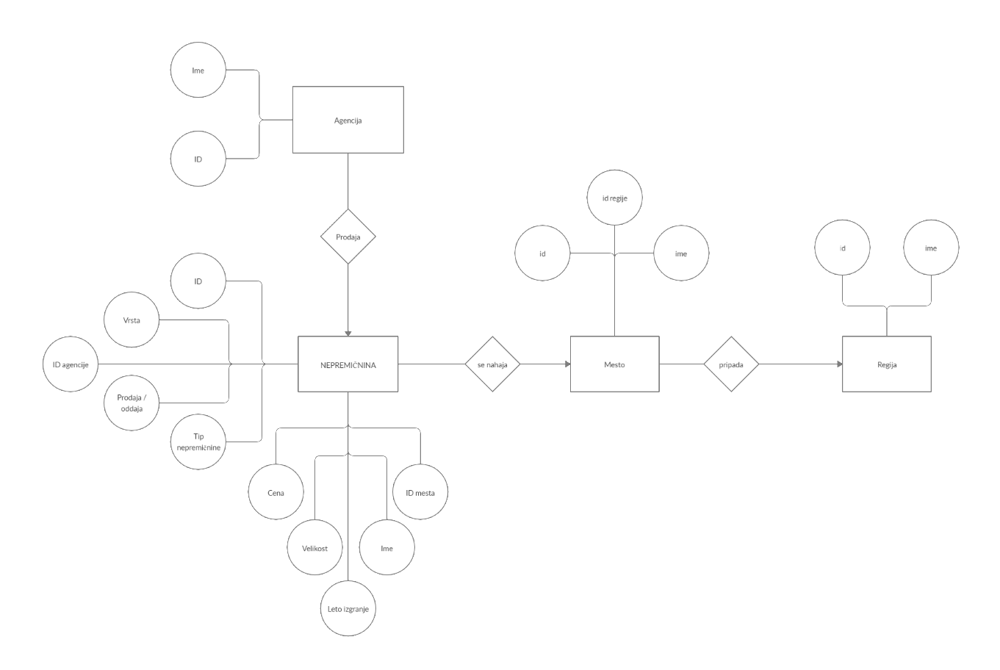

# Nepremičnine

### Projekt pri predmetu Osnove podatkovnih baz 
#### Avtorji: Domen Flakus Bosilj, Sabrina Calcina, Timotej Giacomelli

V našem projektu bomo sestavili bazo nepremičnin. Podatke smo pridobili iz spletne strani www.nepremicnine.net. Sestavili bomo spletno aplikacijo, s katero bomo nepremičnine lahko filtrirali. Kot uporabnik le te, boš lahko dodajal in odstranjeval oglase za nepremičnine, prav tako boš nepremičnine lahko kupil ter izbiral agencije za prodajo in podobno. 

Prilagamo še sliko ER-diagrama, na podlagi katerega smo oblikovali našo podatkovno bazo.

